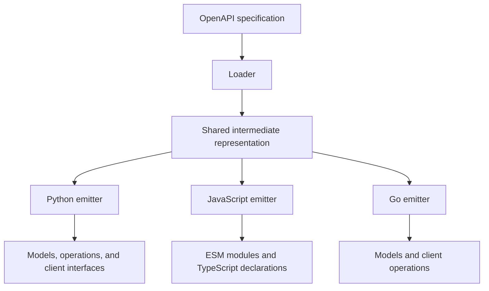
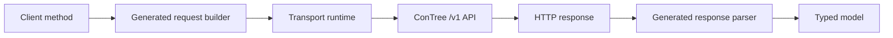

# contree-client

Source and build tooling for the Contree API clients:

- [Python client](client/README.md)
- [JavaScript client](client-js/README.md)
- [Go client](go/v1) — versioned package in the `go` module
- [Client parity](docs/parity.md) — implemented behavior and remaining work
- `codegen/` — OpenAPI generator
- `docs/` — documentation

## Architecture

The repository combines a shared OpenAPI generator with hand-written runtime
code for all clients:



The generated modules contain the API-specific models, request builders,
response parsers and client methods. The hand-written modules provide stable
transport behavior, including authentication profiles, retries, streaming and
error handling. All three clients provide public test doubles; Go uses an
offline HTTP transport with the normal client.

All clients follow the same runtime flow:



Buffered requests pass through the runtime's logging, error mapping and
optional retry handling. Streaming requests keep the response open and parse
server-sent events into typed operation events. Higher-level helpers reconnect
interrupted event streams and resume from the last received event.

Python and JavaScript generated files are ignored by Git. Builds validate them
before packaging them with the maintained runtime code.

Go generated `*.gen.go` files are committed under `go/v1`. Go module proxies
consume the Git tree for a version tag, so each tagged revision must contain a
complete module. Go users do not need the generator or access to the private
specification.

## Development

Set `CONTREE_SPEC` to the OpenAPI specification URL or local path:

```sh
export CONTREE_SPEC=path/to/api.yaml

make          # generate API files; run checks and tests
make docs     # build documentation
make build    # build the Python and npm distributions
make go       # regenerate, lint, and test the Go module
make test-go  # test committed Go sources without the specification
```

The root project is a `uv` workspace containing the generator and Python
client. JavaScript development requires Node.js and npm. The Go module is in
`go`, and its `v1` package requires Go 1.23 or later.

Generation follows the same process for all languages:

1. Load the OpenAPI document and resolve its local references.
2. Convert schemas and paths into the shared intermediate representation.
3. Render the language-specific package into a staging directory.
4. Format, lint and compile the generated files.
5. Replace the previous generated files only after validation succeeds.

CI compiles and tests the committed Go module without the specification. When
the specification secret is available, CI also regenerates Go sources and
checks that the committed files are current.

The existing release workflows regenerate Python and JavaScript packages from
the tagged revision, then publish them to PyPI and npm. The nested Go module
uses subdirectory-prefixed tags such as `go/v1.2.3`.

Copyright 2026 Nebius B.V. Licensed under the [Apache License 2.0](LICENSE).
